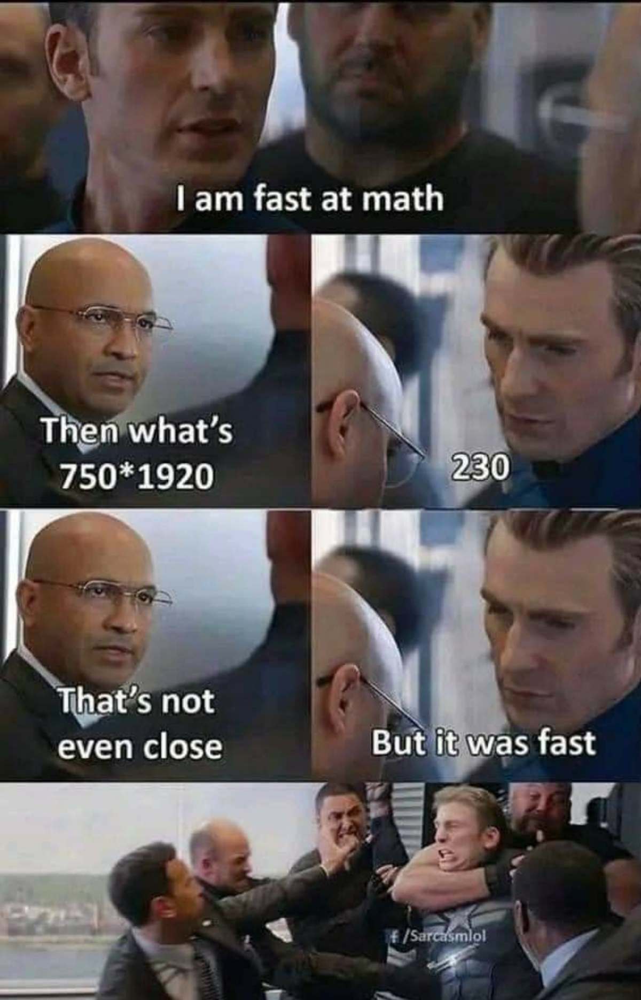

# CTF Writeup: MEMES

## Challenge Info

| Field    | Details       |
|----------|---------------|
| **Name** | MEMES         |
| **Category** | Forensics |
| **Points** | 100        |
| **Solves** | 15         |

## Description

> I like Captain America memes, but every memes are not just memes, i guess this one have some extra meaning...!


## Hint

> Searching out of the box may reveal the flag.

## Attachments

- `meme.png` — A Captain America "I am fast at math" meme image

---

## Solution

### Step 1: Inspect the Image

The challenge provides a PNG file (`meme.png`). The hint says *"Searching out of the box may reveal the flag"* — this strongly hints at data hidden **outside the visible canvas** of the image.

### Step 2: Check the Image Dimensions

The first thing to do is check the image's declared dimensions in the IHDR chunk versus what's actually stored in the file.

```python
from PIL import Image

img = Image.open('meme.png')
print('Size:', img.size)  # (1200, 1870)
print('Mode:', img.mode)  # RGBA
```

The image reports a size of **1200 × 1870** pixels.

### Step 3: Expand the Canvas

The trick here is that PNG files can contain pixel data *beyond* the height declared in the IHDR chunk. By modifying the IHDR height value to be larger, we can force image viewers/libraries to decode the hidden rows.

```python
import struct, zlib

with open('meme.png', 'rb') as f:
    data = bytearray(f.read())

# Read current dimensions from IHDR
width  = struct.unpack('>I', data[16:20])[0]
height = struct.unpack('>I', data[20:24])[0]
print(f'Original: {width}x{height}')  # 1200x1870

# Expand height to reveal hidden rows
new_height = height + 500
data[20:24] = struct.pack('>I', new_height)

# Recalculate CRC for IHDR chunk
ihdr_data = bytes(data[12:29])
crc = zlib.crc32(ihdr_data[0:17]) & 0xFFFFFFFF
data[29:33] = struct.pack('>I', crc)

with open('meme_expanded.png', 'wb') as f:
    f.write(data)
```

### Step 4: View the Hidden Rows

Opening `meme_expanded.png` reveals content hidden below the original canvas boundary. Cropping just the extra rows (below y=1870) shows the flag written in plain text:

```python
from PIL import Image
import numpy as np

img = Image.open('meme_expanded.png')
arr = np.array(img)

# Crop the hidden region
extra = arr[1870:, :, :]
extra_img = Image.fromarray(extra.astype('uint8'))
extra_img.save('extra_rows.png')
```

### Step 5: Flag

The hidden region contains the flag in bold text:

```
OVRD{y0u_s34rch3d_0u7_0f_7h3_b0x_io09hjky}
```

---

## Key Takeaway

This challenge is a classic **hidden canvas / out-of-bounds pixel data** technique. The IHDR chunk in a PNG declares the visible height, but extra compressed pixel data can exist in the IDAT chunks beyond that boundary. By patching the IHDR height and fixing its CRC, you can force decoders to render the hidden rows — revealing data that is literally *"out of the box"*.

### Tools Used
- Python 3
- Pillow (`PIL`)
- `struct` / `zlib` (standard library)
