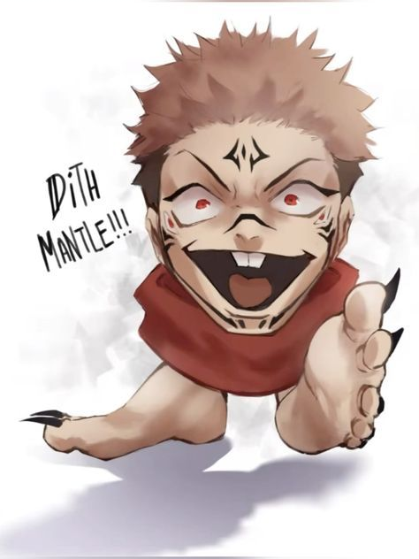

# Brick by Brick — 1

**Category:** Misc / Steganography  
**Points:** 200  

**Flag**  `OVRD{enc0d1ng_d0n3_r1gh7_6d346e373133}`

---

## Challenge Description

> We intercepted a strange sukuna image. At first glance, it looks ordinary, but something is hidden beneath the surface.

> There's no encryption here, only layers of obfuscation.
>
> Dismantle the layers carefully and recover the flag.


---

## TL;DR

Flag is hidden via 4 stacked obfuscation layers:
**LSB (red channel only) → Base64 → Hex → URL encoding + Atbash cipher**

---

## Solution

### Step 1 — Inspect PNG Metadata

First, parse the PNG chunk structure to look for anything unusual:

```python
import struct

with open('challenge.png', 'rb') as f:
    data = f.read()

i = 8  # skip PNG signature
while i < len(data):
    length = struct.unpack('>I', data[i:i+4])[0]
    chunk_type = data[i+4:i+8].decode('ascii', errors='replace')
    chunk_data = data[i+8:i+8+length]
    if chunk_type not in ['IDAT', 'IEND', 'IHDR', 'sRGB', 'gAMA', 'cHRM', 'pHYs']:
        print(f'Chunk: {chunk_type} → {chunk_data}')
    i += 12 + length
```

**Output:**
```
Chunk: tEXt → b'Comment\x00A becomes Z...'
```

The `tEXt` metadata chunk contains a critical hint: **"A becomes Z..."** — this is the Atbash cipher (A↔Z, B↔Y, …).

---

### Step 2 — LSB Steganography (Red Channel Only)

Standard LSB tools (e.g. `stegano`) return nothing. The trick here is that data is encoded **only in the red channel's least-significant bit**, not spread across all three channels.

```python
from PIL import Image
import numpy as np

img = Image.open('challenge.png').convert('RGB')
pixels = np.array(img)

# Extract LSB from red channel only
bits = [px[0] & 1 for row in pixels for px in row]

# Assemble bits into bytes
chars = [int(''.join(map(str, bits[i:i+8])), 2)
         for i in range(0, len(bits) - 7, 8)]
```

Scanning the printable output reveals a Base64 string:

```
NGM0NTQ5NTcyNTM3NDI3NjZkNzgzMDc3MzE2ZDc0NWY3NzMwNmQzMzVmNjkzMTc0NzMzNzVmMzY3NzMzMzQzNjc2MzMzNzMzMzEzMzMzMjUzNzQ0
```

---

### Step 3 — Base64 Decode → Hex String

```python
import base64

b64 = 'NGM0NTQ5NTcyNTM3NDI3NjZkNzgzMDc3MzE2ZDc0NWY3NzMwNmQzMzVmNjkzMTc0NzMzNzVmMzY3NzMzMzQzNjc2MzMzNzMzMzEzMzMzMjUzNzQ0'
hex_str = base64.b64decode(b64).decode()
print(hex_str)
```

**Output:**
```
4c454957253742766d783077316d745f77306d335f69317473375f367733343676333733313333253744
```

---

### Step 4 — Hex Decode → URL-Encoded Ciphertext

```python
url_encoded = bytes.fromhex(hex_str).decode()
print(url_encoded)
```

**Output:**
```
LEIW%7Bvmx0w1mt_w0m3_i1ts7_6w346v373133%7D
```

---

### Step 5 — URL Decode

```python
from urllib.parse import unquote

atbash_text = unquote(url_encoded)
print(atbash_text)
```

**Output:**
```
LEIW{vmx0w1mt_w0m3_i1ts7_6w346v373133}
```

---

### Step 6 — Atbash Decode (A becomes Z)

Apply the Atbash substitution to alphabetic characters only. Numbers, underscores, and braces pass through unchanged.

```python
def atbash(c):
    if 'a' <= c <= 'z': return chr(ord('z') - (ord(c) - ord('a')))
    if 'A' <= c <= 'Z': return chr(ord('Z') - (ord(c) - ord('A')))
    return c

flag = ''.join(atbash(c) for c in atbash_text)
print(flag)
```

**Output:**
```
OVRD{enc0d1ng_d0n3_r1gh7_6d346e373133}
```

---

## Full Solve Script

```python
from PIL import Image
import numpy as np
import base64
from urllib.parse import unquote
import struct

# --- Step 1: Read tEXt chunk hint ---
with open('challenge.png', 'rb') as f:
    data = f.read()

i = 8
while i < len(data):
    length = struct.unpack('>I', data[i:i+4])[0]
    chunk_type = data[i+4:i+8].decode('ascii', errors='replace')
    chunk_data = data[i+8:i+8+length]
    if chunk_type == 'tEXt':
        print(f'[*] Hint found in tEXt chunk: {chunk_data}')
    i += 12 + length

# --- Step 2: LSB extraction (red channel) ---
img = Image.open('challenge.png').convert('RGB')
pixels = np.array(img)
bits = [int(px[0]) & 1 for row in pixels for px in row]
chars = [int(''.join(map(str, bits[i:i+8])), 2)
         for i in range(0, len(bits) - 7, 8)]

# Find printable run containing Base64
printable_run = ''
b64 = ''
for c in chars:
    if 32 <= c < 127:
        printable_run += chr(c)
    else:
        if len(printable_run) > 50:
            b64 = printable_run.strip('?')
            break
        printable_run = ''

print(f'[*] Base64 extracted: {b64}')

# --- Step 3: Base64 decode ---
hex_str = base64.b64decode(b64).decode()
print(f'[*] Hex string: {hex_str}')

# --- Step 4: Hex decode ---
url_encoded = bytes.fromhex(hex_str).decode()
print(f'[*] URL encoded: {url_encoded}')

# --- Step 5: URL decode ---
atbash_text = unquote(url_encoded)
print(f'[*] Atbash ciphertext: {atbash_text}')

# --- Step 6: Atbash decode ---
def atbash(c):
    if 'a' <= c <= 'z': return chr(ord('z') - (ord(c) - ord('a')))
    if 'A' <= c <= 'Z': return chr(ord('Z') - (ord(c) - ord('A')))
    return c

flag = ''.join(atbash(c) for c in atbash_text)
print(f'\n[+] FLAG: {flag}')
```

---

## Obfuscation Layers Summary

| Layer | Technique | Input | Output |
|-------|-----------|-------|--------|
| 1 | LSB steganography (red channel) | PNG pixels | Base64 string |
| 2 | Base64 decode | Base64 string | Hex string |
| 3 | Hex decode | Hex string | URL-encoded text |
| 4 | URL decode + Atbash cipher | URL-encoded Atbash text | Flag |

---

## Key Takeaways

- **Always inspect PNG `tEXt` chunks** — authors often leave hints in metadata that reveal the cipher or technique used.
- **Standard LSB tools fail here** — the data is in the red channel only. When automated tools return nothing, try extracting each color channel independently.
- **The challenge name is a hint** — "Brick by Brick" is a direct metaphor for peeling back one layer at a time.
- **Atbash leaves numbers intact** — only alphabetic characters are substituted, so the flag's numbers and symbols survive unchanged.

---

## Flag

```
OVRD{enc0d1ng_d0n3_r1gh7_6d346e373133}
```
