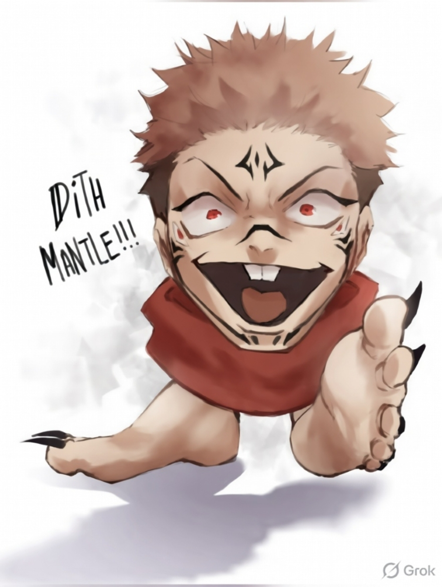

# CTF Writeup: Brick By Brick - 2

> **Category:** Miscellaneous / Steganography  
> **Points:** 400  

> **Flag:** `OVRD{d33p_1n70_r4bb17_h0l3_766f6964}`

---

## Challenge Description

> The image wasn't the end.

> What lies within carries the next piece of the puzzle, but it refuses to reveal itself so easily. Some fragments are hidden, others are broken, and none make sense on their own.
>
> Only by uncovering what's concealed, bringing the pieces together, and restoring what's incomplete can the truth be revealed.

We are given a single file: `challenge.jpg` — an anime-style illustration of Sukuna (from Jujutsu Kaisen) with the text **"DiTH MANTLE!!!"** written on it.

---

## Solution

### Step 1 — Inspect the JPEG Metadata

The first thing to do with any stego image is check its metadata.

```bash
file challenge.jpg
```

Output reveals an embedded **JPEG comment field**:

```
comment: "dGhlIHBhc3MgbGllcyBpbiBwYXJ0IDEgZmxhZw=="
```

Decoding the Base64:

```bash
echo "dGhlIHBhc3MgbGllcyBpbiBwYXJ0IDEgZmxhZw==" | base64 -d
# the pass lies in part 1 flag
```

This tells us: **the steghide password is derived from the Part 1 flag.**

---

### Step 2 — Decode the Part 1 Flag

The Part 1 flag (from challenge "Brick By Brick - 1") was:

```
OVRD{enc0d1ng_d0n3_r1gh7_6d346e373133}
```

The hex string at the end — `6d346e373133` — looks suspicious. Decode it:

```bash
python3 -c "print(bytes.fromhex('6d346e373133').decode())"
# m4n713
```

`m4n713` is leet-speak for **"mantle"** — which connects directly to **"DiTH MANTLE!!!"** written on the challenge image. This is our steghide password.

---

### Step 3 — Extract Hidden Data with Steghide

```bash
steghide extract -sf challenge.jpg -p "m4n713"
# wrote extracted data to "secret.zip"
```

A `secret.zip` is extracted!

---

### Step 4 — Unzip and Inspect

```bash
unzip -l secret.zip
```

```
Archive:  secret.zip
  Length      Date    Time    Name
---------  ---------- -----   ----
        0  2026-04-10 21:51   secret/
    44633  2026-04-10 21:50   secret/flag.jpg
      143  2026-04-10 21:46   secret/information.txt
      200  2026-04-10 21:14   secret/kit.001
---------                     -------
    44976                     4 files
```

Reading `information.txt`:

```
You're not done yet.
Look beyond what the eyes can see.
Only together do they reveal the truth.
Some things appear broken… but aren't.
```

Three items to investigate: `flag.jpg`, `kit.001`, and the hint.

---

### Step 5 — Identify the Split Archive

Running `7z l secret/kit.001` reveals:

```
Path = kit.001
Type = Split
...
Name: final/flag.txt
ERRORS: Unexpected end of archive
```

`kit.001` is the **first part of a split ZIP archive** — and it's incomplete. The clue said *"Some things appear broken… but aren't"* — `flag.jpg` isn't really a JPEG. It's **`kit.002`** in disguise!

```bash
cp secret/kit.001 kit.001
cp secret/flag.jpg kit.002   # flag.jpg is actually part 2!
7z e kit.001
```

---

### Step 6 — Read the Flag

```bash
cat final/flag.txt
```

```
OVRD{d33p_1n70_r4bb17_h0l3_766f6964}
```

---

## Summary

| Step | Action | Finding |
|------|--------|---------|
| 1 | Read JPEG comment | Base64 → *"the pass lies in part 1 flag"* |
| 2 | Decode Part 1 flag hex | `6d346e373133` → `m4n713` (steghide password) |
| 3 | Steghide extract | `secret.zip` hidden in image |
| 4 | Unzip | `flag.jpg`, `kit.001`, `information.txt` |
| 5 | Recognize split archive | `flag.jpg` is actually `kit.002` |
| 6 | 7-Zip extract | `final/flag.txt` contains the flag |

---

## Key Takeaways

- Always check JPEG comment fields — they can carry hints or passwords.
- Hex strings embedded in flags can encode passwords for the next stage.
- Don't trust file extensions. `flag.jpg` was a ZIP archive part.
- Split archives (`.001`, `.002`) need all parts present before extraction.
- Thematic clues in images ("MANTLE") can hint at passwords — pay attention to everything.

---

## Tools Used

- `file` — file type detection
- `base64` — decoding the JPEG comment
- `python3` — hex decoding
- `steghide` — extracting hidden data from JPEG
- `unzip` / `7-Zip` — archive extraction

---

