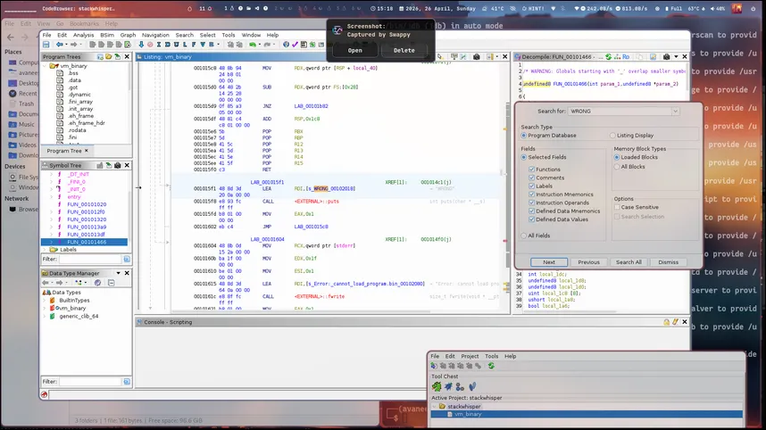
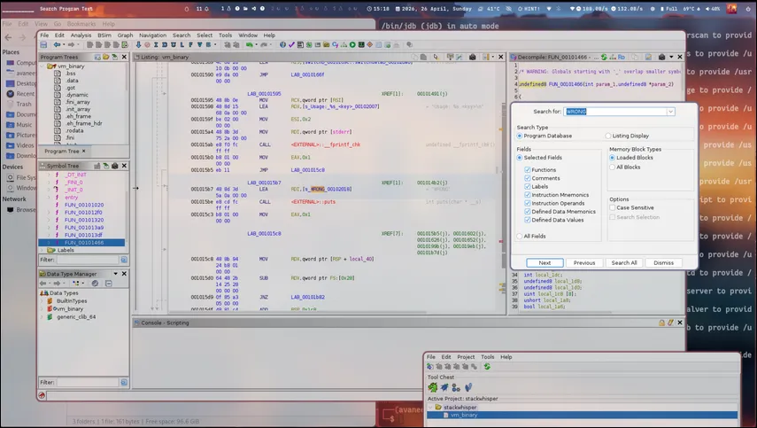
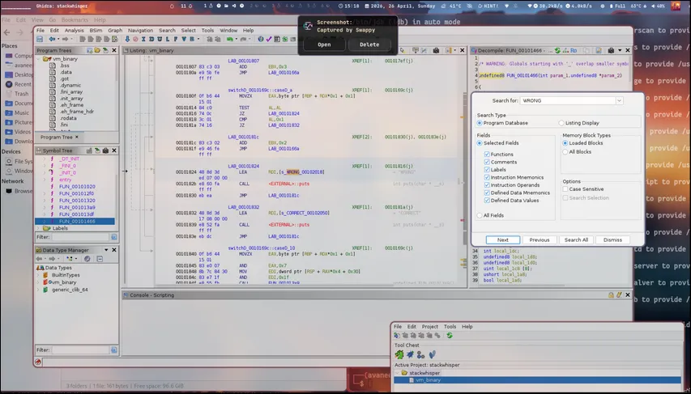

# StackWhisper Writeup

**Category:** Reverse Engineering  
**Challenge:** Custom VM + AES Decryption  
**Flag:** `OVRD{Sp3cTr4L!z}`

---
## 1. Challenge Overview

StackWhisper is a reverse engineering challenge that implements a custom virtual machine (VM) interpreter. Three files are provided:

- **vm_binary**  
  ELF 64-bit stripped executable — the VM interpreter  

- **program.bin**  
  379-byte VM bytecode — the program the VM runs  

- **flag.enc**  
  AES-128-CBC encrypted flag  

The binary accepts a **10-character key** as a command-line argument.  
If the key is correct, it prints `CORRECT` and decrypts `flag.enc`. Otherwise it prints `WRONG`.

---

## 2. Initial Reconnaissance

### Static Analysis

Running `file` and `strings` on `vm_binary` reveals:

- Stripped PIE ELF  
- Dynamically linked with `libcrypto.so.3` (OpenSSL)

Key imported symbols:
- `EVP_aes_128_cbc`
- `EVP_DecryptInit_ex`
- `EVP_DecryptUpdate`
- `EVP_DecryptFinal_ex`
- `SHA256`

This confirms AES-128-CBC decryption using an SHA-256-derived key.

### GDB Dynamic Analysis

Using GDB:

- Breaking on `puts()` reveals two paths:
  - `WRONG`
  - `CORRECT` (at `0x555555555832`)


Jumping directly:

```bash
set $rip = 0x555555555832
```
Prints CORRECT
But causes a segfault during decryption
Meaning: control flow is bypassed, but correct key data is still required

---

## 3. Ghidra Decompilation

Loading the binary into Ghidra and analyzing FUN_00101466 reveals:



A VM dispatch loop

Opcode decoding via:
```
opcode ^ 0xAB
```


Valid opcode range: 0x00–0x13
Jump table dispatch using r13
Key Constraint:
Input must be 10 printable ASCII characters (0x20–0x7E)

---

## 4. VM Architecture
### Registers & State

The VM maintains:

8 general-purpose registers (r0–r7)
16-bit program counter (PC)
1-bit comparison flag
16-byte output buffer (used as AES key)

###  Opcode Table

| Opcode | Mnemonic            | Description        |
|--------|--------------------|--------------------|
| 0x01   | STORE reg, imm32   | Load immediate     |
| 0x02   | MOV dst, src       | Copy register      |
| 0x03   | ADD dst, src       | Addition           |
| 0x04   | CMP dst, src       | Compare            |
| 0x05   | JNZ imm16          | Jump if not zero   |
| 0x06   | MURMUR1 reg        | Hash step          |
| 0x07   | MURMUR2 dst, src   | Combined hash      |
| 0x08   | XOR_TBL reg, idx   | XOR lookup         |
| 0x09   | OUT idx, reg       | Output byte        |
| 0x0A   | PRINT type         | Print result       |
| 0x0B   | LOAD reg, key_idx  | Load key char      |
| 0x10   | FIB reg            | Fibonacci          |
| 0x11   | SINCOS reg         | Math op            |
| 0x12   | SLOW reg           | Anti-analysis      |
| 0x13   | POWMOD reg         | Modular exponent   |

---


## 5. Bytecode Analysis (program.bin)
### 5.1 Disassembly

```asm
0000: SINCOS r5
0002: STORE r3, 0x00000000
0008: LOAD  r0, key[0]
000b: FIB   r6
000d: MOV   r1, r0
0010: MURMUR1 r1
0012: STORE r2, 0x4c57e26c
0018: CMP   r1, r2
001b: JNZ   0x0178
001e: MOV   r3, r1
0021: SLOW  r7
```
Repeats for all 10 characters

Final phase derives AES key

### Validation Algorithm
```
def murmur1(x):
    x = (x * 0x5bd1e995) & 0xFFFFFFFF
    x ^= (x >> 13)
    x = (x * 0x5bd1e995) & 0xFFFFFFFF
    x ^= (x >> 15)
    return x
```
Validation chain:
```
r3 = 0
murmur1(key[0]) == 0x4c57e26c
murmur1(key[1] + r3) == 0x6a4d4a45
...
murmur1(key[9] + r3) == 0x1f144292
```
Each step depends on previous result (r3)

## 6. Key Recovery
### Solver Script
```
targets = [
    0x4c57e26c, 0x6a4d4a45, 0x8478e8a7, 0x6bb2131e,
    0x18789f23, 0x340a6716, 0x6d026250, 0x53b5e169,
    0xbbb89837, 0x1f144292,
]

def murmur1(x):
    x = (x * 0x5bd1e995) & 0xFFFFFFFF
    x ^= (x >> 13)
    x = (x * 0x5bd1e995) & 0xFFFFFFFF
    x ^= (x >> 15)
    return x

key = []
r3 = 0

for target in targets:
    for c in range(0x20, 0x7f):
        if murmur1((c + r3) & 0xFFFFFFFF) == target:
            key.append(chr(c))
            r3 = target
            break

print("Key:", "".join(key))
```
Result
```
Recovered Key: Sp3cTr4L!z
```
Verification:
```
./vm_binary Sp3cTr4L!z
```
Output:

CORRECT
```
OVRD{Sp3cTr4L!z}
```
